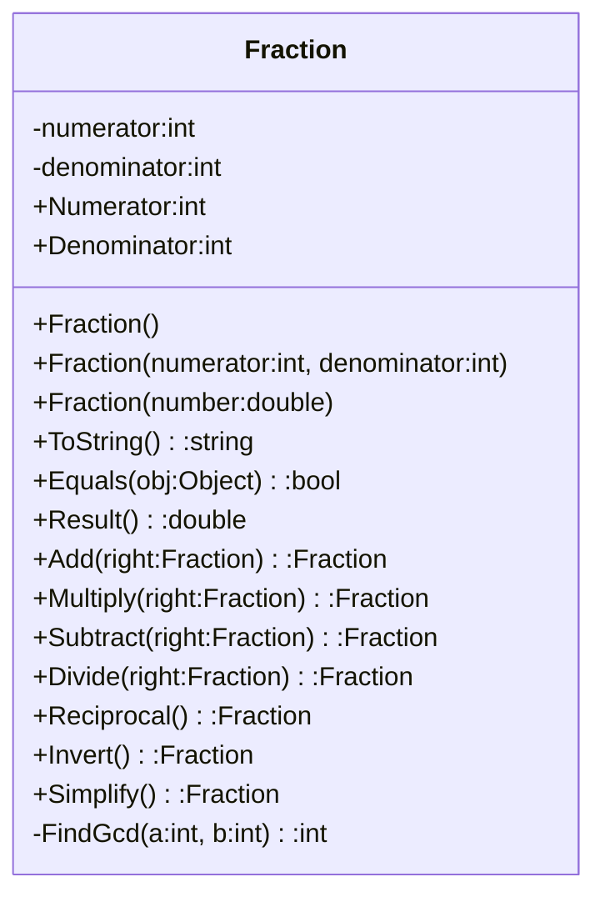
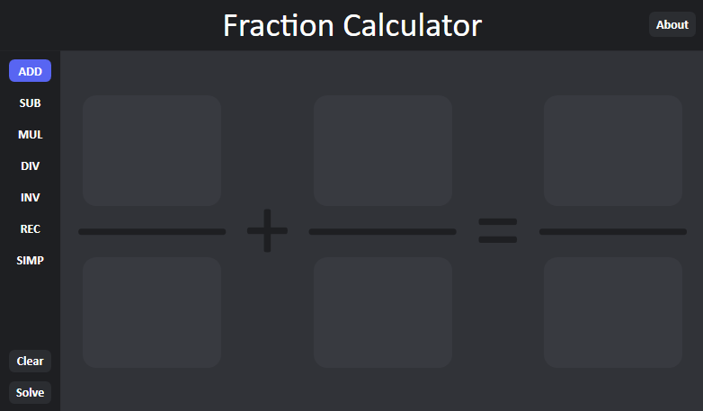
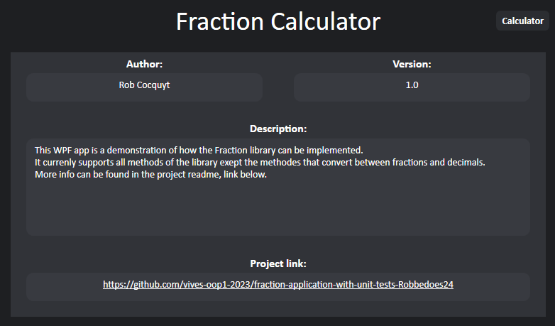
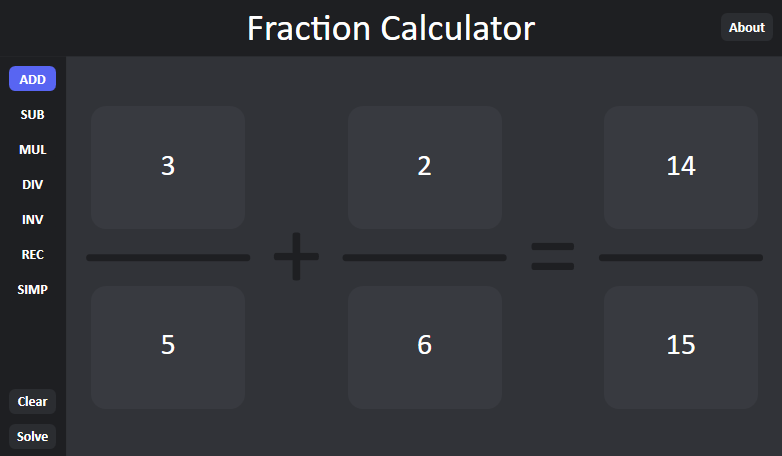
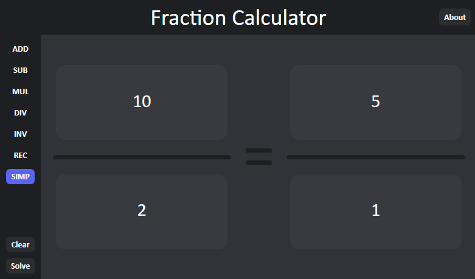
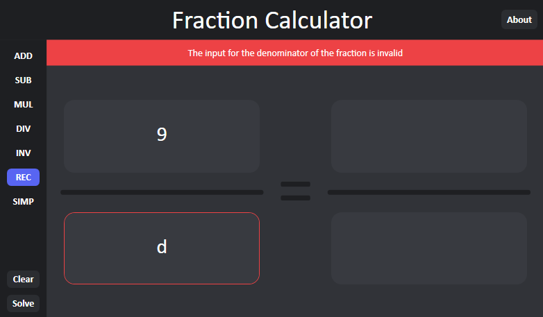

# Fraction Application

By: [Rob Cocquyt](https://github.com/Robbedoes24)

## Table of Contents

1. [Introduction](#1-introduction)
2. [How to use](#2-how-to-use)
    1. [Download the source code](#21-download-the-source-code)
    2. [Download the release](#22-download-the-release)
3. [Fraction Library](#3-fraction-library)
    1. [UML Diagram](#31-uml-diagram)
4. [Unit Tests](#4-unit-tests)
    1. [How to run the unit tests](#41-how-to-run-the-unit-tests)
5. [Console Application](#5-console-application)
6. [WPF Application](#6-wpf-application)
    1. [Features](#61-features)
    2. [Screenshots](#62-screenshots)
7. [Future Improvements](#7-future-improvements)

## 1. Introduction

This is a simple fraction application. It contains a fraction library, unit tests, a console application and a WPF application.

## 2. How to use

There are 2 ways to use the application(s):

- Download the source code and run the application(s) from Visual Studio
- Download the release and run the application(s)

### 2.1 Download the source code

1. Download the source code from [GitHub](https://github.com/vives-oop1-2023/fraction-application-with-unit-tests-Robbedoes24)
2. Open the solution in Visual Studio (we used Visual Studio 2022)
3. Right click on the application you want to run and click on `Set as Startup Project`
4. Run the application

### 2.2 Download the release

1. Download the release from [GitHub](https://github.com/vives-oop1-2023/fraction-application-with-unit-tests-Robbedoes24)
2. Extract the zip file
3. Select the application you want to run and run it

## 3. Fraction Library

The fraction library contains a fraction class. This class can be used to do some basic operations with fractions.

### 3.1 UML Diagram

## 4. Unit Tests

The unit tests are written with the XUnit framework.
The tests are used to test the fraction library.
They test all the methods, constructors and properties of the fraction class on different scenarios (normal, edge cases, invalid input, etc.).

### 4.1 How to run the unit tests

To run the unit tests, you need to have the XUnit test runner installed in Visual Studio and have the source code downloaded see [2.1 Download the source code](#21-download-the-source-code) for more information.

When you have the source code open in Visual Studio, you can run the unit tests by clicking on `Test` -> `Run` -> `All Tests`.

## 5. Console Application

The console application is a demo application that uses the fraction library.
It contains examples of how to use the different parts of the fraction library.

## 6. WPF Application

The WPF application is a demo application that uses the fraction library.
It implements most of the available methods of the fraction library, except for the `Result()` method and the double constructor.

### 6.1 Features

The WPF application has the following features:

- Operations with 2 fractions (addition, subtraction, multiplication, division)
- Operations on 1 fraction (reciprocal, invert, simplify)
- Automatic hide/Show of 2nd fraction when needed (when the user selects an operation that only needs 1 fraction)
- User input validation (only integers are allowed, no division by zero)
- User notifications (show a message when user input is invalid)
- User error indication (highlight the input field that is invalid)
- User friendly interface (buttons, labels, etc.)
- Customizable theme (in the App.xaml file)

### 6.2 Screenshots

#### Calculator page

#### About page

#### Operation with 2 fractions

#### Operation on 1 fraction

#### Invalid input

## 7. Future Improvements

The following improvements can be made to the project:

- Reorganize the code (after adding and changing the code, the code is a bit messy)
- Use the `Result()` method in the WPF application
- Use the double constructor in the WPF application
- Background of buttons when hovered over (currently uses the default template color, so it's ugly)
- Some ui improvements (better layout on the about page, more rounded corners, etc.)
